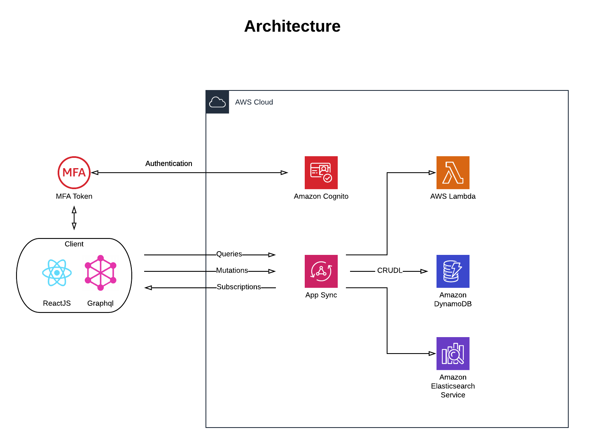

# What is this?

This is an wip project that uses [AWS Amplify](https://aws-amplify.github.io/) for the backend
and reactjs for the client. Graphql and AWS Appsync is the glue to connects the frontend to the backend. The current destination is unknown at this point. I'm just cutting my teeth on reactjs and needed a project to practice.

Amplify is used to setup Authentication, Appsync, Storage in the cloud.

# Architecture




# Getting things setup

This project was bootstrapped with [Create React App](https://github.com/facebook/create-react-app).

### Dependencies
```
yarn global add @aws-amplify/cli
yarn global add create-react-app
yarn add aws-amplify aws-amplify-react bootstrap
```
### Setup AWS Backend
```
amplify configure
amplify init
amplify add api
amplify push
```

### Runs the app in the development mode.<br>

```
amplify serve
```
Open [http://localhost:3000](http://localhost:3000) to view it in the browser.

### This sets up hosting on cloudfront or from an S3 Bucket

```
amplify add hosting
amplify hosting configure
amplify publish
```


### Deletes all backend resources and cleans up local archive
```
amplify delete
```
