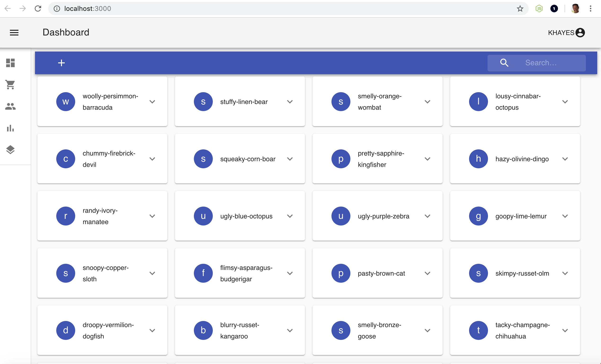

# What is this?

This is an wip project that uses [AWS Amplify](https://aws-amplify.github.io/) for the backend
and reactjs for the client. Graphql and AWS Appsync is the glue to connects the frontend to the backend. The current destination is unknown at this point. I'm just cutting my teeth on reactjs and needed a project to practice.
Amplify also supports Vue, Angular, React Native and a few other client frameworks.

Amplify is used to setup Authentication, Appsync, and Storage in the cloud.

# Architecture


# Getting things setup
This project was bootstrapped with [Create React App](https://github.com/facebook/create-react-app).

### Dependencies
```
yarn global add @aws-amplify/cli
yarn add aws-amplify aws-amplify-react
```
### UI Framework
Currently I'm using Material UI
https://www.materialui.co/icons

```
yarn install
```

### Setup AWS Backend
You need an AWS account to get the backend setup. Costs are minimal since I'm striving for a serverless architecture.
Check out [AWS Amplify](https://aws-amplify.github.io/docs/js/react) to see the details on how this works.

This command will setup an AWS user for amplify to build the cloud resources. Just follow along.
```
amplify configure
```

This command initializes the project. Framework to use, editor etc. Were using react for this project.
```
amplify init
```


During the next step it will ask you Do you have an annotated GraphQL schema? (y/N) enter yes
For the file use saveme.graphql
This will change over time and I have it in the root directory of this project because if you run amplify delete it will delete the amplify directory that contains schema.graphql that amplify uses to setup appsync.
```
amplify add api
```


This command builds the backend. Check out Cloudformation to see what it is doing.
```
amplify push
```
This takes about 20 minutes. Creating the ElasticSearch is pretty slow.


Amplify uses nested CloudFormation stacks to build the environment.


### Runs the app in the development mode.<br>
Setup account, login, logout, forgot password, MFA is all handled for you by amplify.
```
amplify serve
```
Open [http://localhost:3000](http://localhost:3000) to view it in the browser.
Create an account, validate with MFA and login.





### amplify serve has errors.
Do this in the root directory of your app:
```
rm -rf node_module
rm yarn.lock
yarn install
```

### This sets up hosting on cloudfront or from an S3 Bucket

```
amplify add hosting
amplify hosting configure
amplify publish
```


### Deletes all backend resources and cleans up local archive
```
amplify delete
```
After delete:
1. Be sure to delete the src/aws-exports.json file.
2. You can run amplify init to restart the build process assuming you didn't delete the IAM user.


### References

The documentation for amplify is ok but real world examples are missing.
So here is a list of useful links for referencing examples.
1. https://amplify-workshop.go-aws.com/
2. https://github.com/aws-samples/aws-amplify-graphql
3. https://medium.com/open-graphql/create-a-multiuser-graphql-crud-l-app-in-10-minutes-with-the-new-aws-amplify-cli-and-in-a-few-73aef3d49545
4. https://read.acloud.guru/build-your-own-multi-user-photo-album-app-with-react-graphql-and-aws-amplify-18d9cfe27f60
5. https://medium.com/open-graphql/implementing-search-in-graphql-11d5f71f179
6. https://amplify-workshop.go-aws.com/140_bonus/10_lightbox_photos.html
7. https://code.tutsplus.com/tutorials/how-to-build-serverless-graphql-and-rest-apis-using-aws-amplify--cms-31873
8. https://devexpress.github.io/devextreme-reactive/react/grid/demos/featured/integrated-data-shaping/
9. https://read.acloud.guru/backend-graphql-how-to-trigger-an-aws-appsync-mutation-from-aws-lambda-eda13ebc96c3
10. https://sandny.com/2018/08/26/how-to-mutate-aws-graphql-using-aws-lambda/

### CLI Commands

Create sample data:
In the src/assets directory is a python script called createDevices.py

In order for the the script to run you need an environment variable called:

DYNAMODB_TABLE

To find the dynamodb table name run this from the command line:
```
aws dynamodb list-tables
```
The export it like this:
```
export DYNAMODB_TABLE=ENTER_YOUR_TABLE_NAME_HERE
```

Number of device is set to 100. You can change the NUM_DEVICES global variable in the script if you want.
NUM_DEVICE=100

The script has the following dependencies:
```
pip install boto3 namegenerator faker
```

Run:
```
python src/assets/createDevices.py
```

####Get the domain name
```
aws es list-domain-names
```

#### Find the domain endpoint
```
aws es describe-elasticsearch-domain --domain-name
```

### TODO

1. Implement search feature in app bar: &#9745;
2. Re-add subscriptions to CardView for CRUD activities: &#9745;
3. Add menu to switch from card to table view for devices: WIP
3. Implement CI/CD Pipeline for deployment:

### OBSOLETE

Subscriptions are now handle individually using amplify API.
A subscriptions for Create, Delete, and Update are all handled individually.
Plus is seem <Connect/> gets triggered when use API so I removed it and handle them all individually.

One last thing I need to resolve. Using the amplify <Connect/> component only allows for 1 subscription. I am interested in Creates, Updates and Deletes so I add an consolidated subscription that notify's the app if any of those condition occur.
Has to be a better way but until I figure that out here's a work around.

In the aws console open the appsync service select schema, find the type Subscriptions part and a onAnySubs item.
```
type Subscription {
	...
	onAnySubs: Device
		@aws_subscribe(mutations: ["createDevice", "updateDevice", "deleteDevice"])
}
```

Add this to src/graphql/subscriptions.js
```
export const onAnySubs = `subscription onAnySubs {
  onDeleteDevice {
    id
    serialNumber
    group
    deviceId
    activationCode
    activated
    name
    type
    endpoint
  },
  onUpdateDevice {
    id
    serialNumber
    group
    deviceId
    activationCode
    activated
    name
    type
    endpoint
  },
  onCreateDevice {
    id
    serialNumber
    group
    deviceId
    activationCode
    activated
    name
    type
    endpoint
  }
}
`;
```
